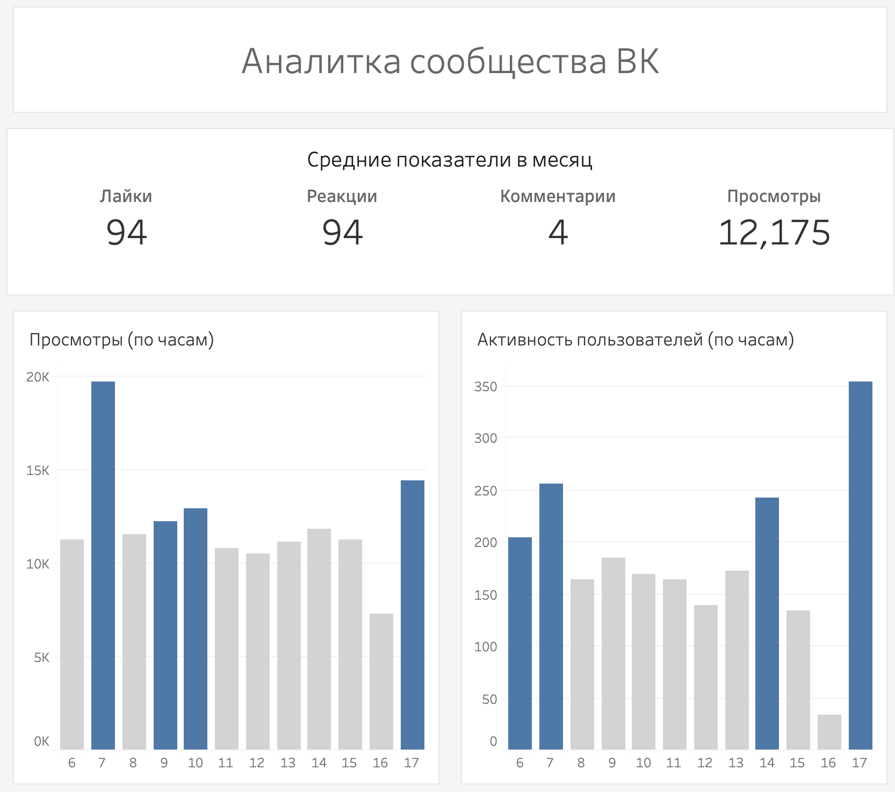

# VK-analytics
ETL пайплайн для выгрузки данных со стены сообщества ВК, их обработки и загрузки в БД и Google Sheets

    

## Описание
Данные берем при помощи HTTP запросов к <a href="https://dev.vk.com/ru/reference" target="blank">VK API</a>, метод <i>wall.get</i>. Тело запроса:
```json
{
    "access_token": "VK_TOKEN", // Серверный ключ приложения
    "v": "5.199", // Версия API
    "domain": "", // Короткое название сообщества
    "count": 100, // Количестко записей
    "offset": 0 // Сдвиг данных
}
```
Из полученных данных отбираются следующие поля:
| Параметр    | Описание |
| -------- | ------- |
| text | Текст поста |
| date | Дата публикации поста
| likes_count | Колличество лайков |
| comments_count | Колличество комментариев |
| reactions_count | Колличество реакций |
| views_count | Колличество просмотров |

Данные преобразуются и обрабатываются. Затем результат инкрементально загружается в базу данных и на Google Sheets.

Пример дашборда для аналитики сообщества ВК (Tableau):



## Как развернуть проект?
1) Склонировать репозиторий
2) Добавть файл окружения .env в корневую директорию проекта со значениями:
```
AIRFLOW_UID=501 

# VK access_token
VK_TOKEN=<your_token>

# Google Cloud Crededentials
KEY_FILE=<path to your credentials>
SPREADSHEET_ID=<id of spreadsheet in Google Sheets>
```
3) Сбилдить образ и поднять контейнеры Docker:
```
docker-compose build
docker-compose up airflow-init
docker-compose up
```
